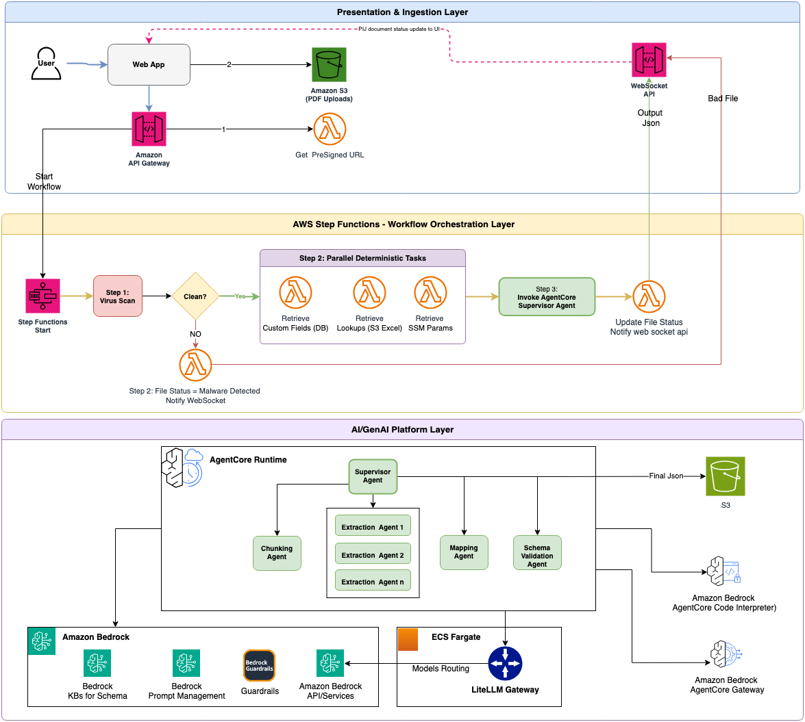

# Document Processing Platform

> **Security Considerations:** This is sample code for demonstration and educational purposes only. It should not be used in production accounts or on production or critical data without additional security review and hardening. You are responsible for testing, securing, and optimizing this content for production-grade use based on your specific requirements.

An AI-powered document processing platform that extracts structured data from PDF documents using Amazon Bedrock and multi-agent orchestration. Upload a PDF, and the platform automatically chunks, extracts, maps, and validates data into a target JSON schema.



## Demo


[▶️ Watch the demo recording](docs/sample-document-processing.mp4)

## Architecture

The platform is organized into four layers:

1. **Presentation and Ingestion** — React UI with S3 pre-signed URL uploads, REST and WebSocket APIs (API Gateway + Lambda + DynamoDB)
2. **Workflow Orchestration** — AWS Step Functions state machine with GuardDuty malware scanning, parallel data retrieval, and agent invocation
3. **AI/GenAI Platform** — Five Strands agents on Amazon Bedrock AgentCore (Supervisor, Chunking, Extraction, Mapping, Validation) with LiteLLM Gateway for model routing and spend tracking
4. **Observability** — CloudWatch dashboards, AgentCore tracing, and LiteLLM metrics

## Project Structure

```
├── ui/                    # React frontend (Next.js static export + CloudFront)
├── backend/               # REST/WebSocket APIs (Lambda + API Gateway + DynamoDB)
├── workflow/              # Step Functions state machine
├── agents/supervisor/     # Strands multi-agent pipeline (AgentCore)
├── llm-gateway/           # LiteLLM proxy (ECS Fargate)
├── vpc/                   # Shared VPC infrastructure
└── docs/                  # Design docs and implementation guides
```

Each directory contains its own `infra/` folder with AWS CDK (TypeScript) infrastructure code.

## Prerequisites

- AWS account with Bedrock model access enabled for Claude Sonnet and Claude Haiku
- AWS CLI v2 configured with appropriate credentials
- Node.js 18+ and npm (for CDK and UI)
- Python 3.12+ and uv (for agents)
- Docker (for local LLM Gateway development)

## Configuration

All secrets and account-specific values are externalized into environment variables. Nothing is hardcoded — you must configure each subproject before deploying.

### How it works

Each subproject has a `.env.example` template. Copy it to `.env`, fill in your values, and the application reads them at runtime. `.env` files are git-ignored and never committed.

CDK infrastructure stacks read values from environment variables, CDK context, or resolve them dynamically (e.g., `cdk.Stack.of(this).account`). After each CDK deploy, stack outputs are written to a local `cdk-outputs.json` file — these are also git-ignored since they contain your account-specific resource ARNs and endpoints.

### Step 1: Root environment

```bash
cp .env.example .env
```

Edit `.env`:

| Variable | Description | Example |
|----------|-------------|---------|
| `AWS_ACCOUNT_ID` | Your 12-digit AWS account ID | `123456789012` |
| `AWS_REGION` | AWS region to deploy into | `us-east-1` |

### Step 2: VPC and networking

No `.env` needed. Deploy first — other stacks depend on its exports.

```bash
cd vpc/infra && npm install && npx cdk deploy --all
```

### Step 3: Backend APIs

```bash
cp backend/.env.example backend/.env
```

Edit `backend/.env`:

| Variable | Description | How to get it |
|----------|-------------|---------------|
| `AWS_REGION` | AWS region | `us-east-1` |
| `DOCUMENTS_TABLE` | DynamoDB table name | Default: `DocumentProcessing-Documents` |
| `CONNECTIONS_TABLE` | WebSocket connections table | Default: `DocumentProcessing-WebSocketConnections` |
| `DOCUMENT_BUCKET` | S3 bucket for documents | `document-processing-<YOUR_AWS_ACCOUNT_ID>` |
| `WEBSOCKET_API_ENDPOINT` | WebSocket URL | From CDK output after deploy |
| `WORKFLOW_STATE_MACHINE_ARN` | Step Functions ARN | From CDK output after deploying workflow |
| `PRESIGNED_URL_EXPIRY` | Pre-signed URL TTL in seconds | Default: `3600` |

Deploy:

```bash
cd backend/infra && npm install && npx cdk deploy --all
```

After deploy, note the REST API and WebSocket URLs from the CDK outputs — you'll need them for the UI.

### Step 4: LLM Gateway

```bash
cp llm-gateway/.env.example llm-gateway/.env
```

Edit `llm-gateway/.env`:

| Variable | Description | How to get it |
|----------|-------------|---------------|
| `LITELLM_ADMIN_KEY` | Admin API key (must start with `sk-`) | Generate: `echo "sk-$(openssl rand -hex 24)"` |
| `LITELLM_SALT_KEY` | Encryption key for stored credentials | Generate: `openssl rand -hex 16` |
| `DATABASE_URL` | PostgreSQL connection string | For local: `postgresql://litellm:<DB_PASSWORD>@localhost:5432/litellm` |
| `UI_USERNAME` | Admin UI username | Default: `admin` |
| `UI_PASSWORD` | Admin UI password | Choose a strong password |
| `AWS_REGION_NAME` | AWS region for Bedrock calls | `us-east-1` |

For local development with Docker Compose, also set `POSTGRES_PASSWORD` (used by the postgres container):

```bash
export POSTGRES_PASSWORD=<your-db-password>
docker-compose up
```

For production (ECS Fargate), CDK creates secrets in AWS Secrets Manager automatically — no manual `.env` needed on the server.

Deploy:

```bash
cd llm-gateway/infra && npm install && npx cdk deploy --all
```

After deploy, note the ALB DNS name from the CDK output (`AlbDnsName`) — the supervisor agent needs it. Also note the CloudFront domain from `CloudFrontDomain` — you'll use it to access the LiteLLM dashboard.

#### Accessing the LiteLLM Dashboard

LiteLLM provides a built-in admin dashboard for monitoring model usage, managing API keys, and viewing spend tracking.

| Environment | URL | Credentials |
|-------------|-----|-------------|
| **Local** (Docker Compose) | `http://localhost:4000/ui` | `UI_USERNAME` / `UI_PASSWORD` from `llm-gateway/.env` |
| **Production** (ECS Fargate) | `https://<CloudFrontDomain>/ui` | Stored in AWS Secrets Manager (`document-processing/llm-gateway/ui-credentials`) |

To get the CloudFront URL after deploying:

```bash
# From CDK output
cd llm-gateway/infra && cat cdk-outputs.json | grep CloudFrontDomain
```

From the dashboard you can:

- View model usage and spend per API key
- Monitor request logs and latency
- Create and manage virtual API keys for different consumers
- Check model health and routing status

### Step 5: Supervisor agent

```bash
cp agents/supervisor/.env.example agents/supervisor/.env
```

Edit `agents/supervisor/.env`:

| Variable | Description | How to get it |
|----------|-------------|---------------|
| `AWS_REGION` | AWS region | `us-east-1` |
| `AWS_ACCOUNT_ID` | Your AWS account ID | Your 12-digit account ID |
| `LLM_GATEWAY_URL` | Internal ALB endpoint for the LLM Gateway | From LLM Gateway CDK output (`AlbDnsName`), prefixed with `http://` (internal VPC traffic) |
| `LLM_GATEWAY_API_KEY` | Gateway API key (local dev only) | The `LITELLM_ADMIN_KEY` you generated in Step 4 |
| `LLM_GATEWAY_API_KEY_SECRET_ARN` | Secrets Manager ARN for the API key (production) | From LLM Gateway CDK output (`MasterKeySecretArn`) |

In production on AgentCore, the agent reads the API key from AWS Secrets Manager instead of the environment variable. The secret is created automatically by the LLM Gateway CDK stack (`document-processing/llm-gateway/admin-key`). Set the `LLM_GATEWAY_API_KEY_SECRET_ARN` environment variable to the ARN from the CDK output.

Deploy to AgentCore — see [agents/README.md](agents/README.md) for full instructions.

### Step 6: Workflow orchestration

```bash
cp workflow/.env.example workflow/.env
```

Edit `workflow/.env`:

| Variable | Description | How to get it |
|----------|-------------|---------------|
| `AWS_REGION` | AWS region | `us-east-1` |
| `DOCUMENT_BUCKET` | S3 bucket | `document-processing-<YOUR_AWS_ACCOUNT_ID>` |
| `AGENT_RUNTIME_ARN` | AgentCore supervisor ARN | From AgentCore after deploying the agent (Step 5) |
| `DOCUMENTS_TABLE` | DynamoDB table | Default: `DocumentProcessing-Documents` |
| `TASK_TOKEN_TABLE` | Scan task token table | Default: `DocumentProcessing-ScanTaskTokens` |
| `NOTIFY_FUNCTION_ARN` | Backend notify Lambda ARN | From backend CDK output (`NotifyFunctionArn`) |

Deploy:

```bash
cd workflow/infra && npm install && npx cdk deploy --all
```

### Step 7: UI

```bash
cp ui/.env.local.example ui/.env.local
```

Edit `ui/.env.local`:

| Variable | Description | How to get it |
|----------|-------------|---------------|
| `NEXT_PUBLIC_API_URL` | Backend REST API URL | From backend CDK output (`RestApiUrl`) |
| `NEXT_PUBLIC_WS_URL` | Backend WebSocket URL | From backend CDK output (`WebSocketApiUrl`) |

Deploy:

```bash
cd ui && npm install && npm run build
cd infra && npm install && npx cdk deploy
```

#### Accessing the UI

| Environment | URL | How to get it |
|-------------|-----|---------------|
| **Local** (development) | `http://localhost:3000` | Run `npm run dev` from the `ui/` directory |
| **Production** (CloudFront) | `https://<CloudFrontDomain>` | From UI CDK output (`CloudFrontDomain`) |

To get the production URL after deploying:

```bash
cd ui/infra && cat cdk-outputs.json | grep CloudFrontDomain
```

The UI connects to the backend REST API and WebSocket endpoints configured in `ui/.env.local`. Make sure the backend (Step 3) is deployed and the environment variables `NEXT_PUBLIC_API_URL` and `NEXT_PUBLIC_WS_URL` are set before building.

### Configuration reference files

Each subproject includes example configuration files with placeholder values:

| File | Purpose |
|------|---------|
| `.env.example` | Root environment variables |
| `backend/.env.example` | Backend Lambda configuration |
| `workflow/.env.example` | Step Functions workflow configuration |
| `llm-gateway/.env.example` | LiteLLM Gateway configuration |
| `agents/supervisor/.env.example` | Supervisor agent configuration |
| `**/cdk-outputs.example.json` | Example CDK outputs showing the structure of deployed resource identifiers |
| `agents/supervisor/.bedrock_agentcore.example.yaml` | Example AgentCore deployment configuration |

## Deployment Order

Stacks have cross-stack dependencies. Deploy in this order:

```
1. vpc/infra          → VPC, subnets, security groups
2. backend/infra      → API Gateway, Lambda, DynamoDB, S3
3. llm-gateway/infra  → Aurora, ECS Fargate, ALB
4. agents/supervisor  → AgentCore deployment
5. workflow/infra     → Step Functions, EventBridge, GuardDuty integration
6. ui/infra           → S3 static site, CloudFront
```

After deploying each stack, check the CDK outputs for resource identifiers needed by downstream stacks. CDK outputs are printed to the terminal and saved to `cdk-outputs.json` in each `infra/` directory.

## How It Works

1. User uploads a PDF through the React UI
2. The file is scanned for malware via GuardDuty
3. Step Functions orchestrates the processing pipeline
4. The Supervisor agent delegates work to specialized sub-agents:
   - **Chunking** — splits large PDFs into manageable pieces
   - **Extraction** — extracts field values from each chunk (runs in parallel)
   - **Mapping** — merges extractions into the target JSON schema
   - **Validation** — validates the output against the schema
5. Results are stored in S3 and the user is notified via WebSocket

## Documentation

- [Technical Design](docs/design.md) — full architecture and data model
- [LLM Gateway Implementation](docs/implementation-llm-gateway.md) — gateway setup and observability
- [Backend and UI Implementation](docs/implementation-backend-ui.md) — API and frontend details

## Cost Estimate (Dev Environment)

| Component | Monthly Cost |
|-----------|-------------|
| ECS Fargate (LLM Gateway) | ~$30 |
| Aurora Serverless v2 | ~$44 |
| ALB (internal) | ~$18 |
| NAT Gateway | ~$32 |
| Lambda, API Gateway, DynamoDB | ~$5 |
| CloudFront + S3 | ~$2 |
| **Total (excluding Bedrock usage)** | **~$131/month** |

Bedrock model costs are usage-based and billed separately per token.

## Cleanup

To avoid ongoing charges, destroy all infrastructure in **reverse deployment order**. Each component has a `destroy.sh` script.

### Cleanup Order

```
1. ui/infra/destroy.sh            → CloudFront, S3, KMS key
2. workflow/infra/destroy.sh      → Step Functions, EventBridge, Lambda
3. agents/supervisor              → Delete AgentCore agent (via CLI or console)
4. llm-gateway/infra/destroy.sh   → ECS Fargate, ALB, Aurora, Secrets Manager
5. backend/infra/destroy.sh       → API Gateway, Lambda, DynamoDB
6. backend/infra/destroy-s3.sh    → Document S3 bucket + KMS CMK (interactive — prompts for confirmation)
7. vpc/infra/destroy.sh           → VPC, subnets, NAT Gateway, security groups (MUST be last)
```

### Quick cleanup (all stacks)

```bash
# 1. UI
cd ui/infra && ./destroy.sh

# 2. Workflow
cd workflow/infra && ./destroy.sh

# 3. AgentCore agent (manual — no CDK stack)
# Delete via the AgentCore console or CLI:
#   aws bedrock-agentcore delete-agent-runtime --agent-runtime-id <AGENT_ID>

# 4. LLM Gateway
cd llm-gateway/infra && ./destroy.sh

# 5. Backend APIs
cd backend/infra && ./destroy.sh

# 6. S3 document bucket (prompts for confirmation)
cd backend/infra && ./destroy-s3.sh

# 7. VPC (must be last — other stacks depend on it)
cd vpc/infra && ./destroy.sh
```

### What gets deleted

| Component | Resources Removed |
|-----------|-------------------|
| UI | CloudFront distribution, S3 site bucket, S3 access logs bucket, KMS key |
| LLM Gateway | ECS Fargate service, ALB, Aurora Serverless v2, Secrets Manager secrets, CloudWatch log group |
| Workflow | Step Functions state machine, EventBridge rules, Lambda functions, DynamoDB task token table |
| Backend | REST API Gateway, WebSocket API Gateway, Lambda functions, DynamoDB tables |
| S3 Bucket | Document bucket (all objects, versions, and delete markers), KMS CMK |
| VPC | VPC, public/private subnets, NAT Gateway, Internet Gateway, security groups, bastion host |

### What is NOT automatically deleted

- **CloudWatch Logs** — Log groups with retention policies expire automatically but are not deleted by `cdk destroy`. Delete manually if needed: `aws logs delete-log-group --log-group-name <name>`
- **CDK bootstrap resources** — The `CDKToolkit` stack (S3 bucket + ECR repo for assets) is shared across all CDK apps in the account. Only delete if no other CDK apps use it.
- **ECR container images** — CDK asset images may remain in the bootstrap ECR repository.
- **KMS keys** — Scheduled for deletion with a 7-day waiting period (cannot be immediately deleted).

## Security

See [CONTRIBUTING](CONTRIBUTING.md#security-issue-notifications) for more information.

## License

This library is licensed under the MIT-0 License. See the LICENSE file.

